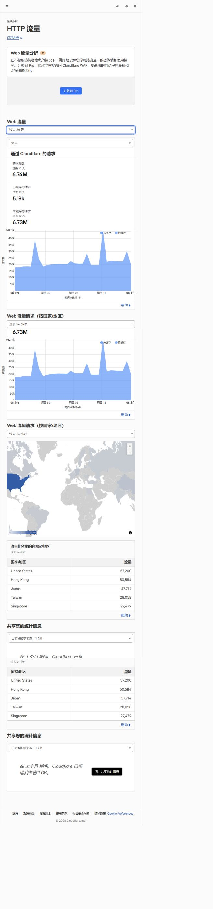
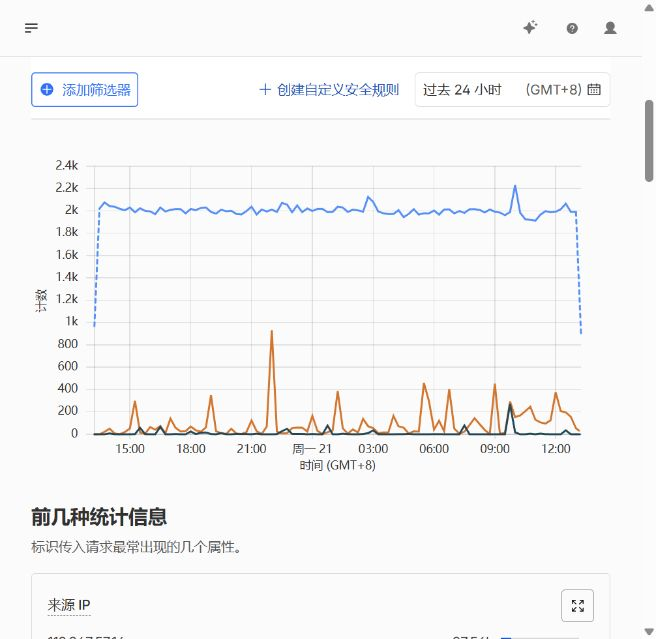
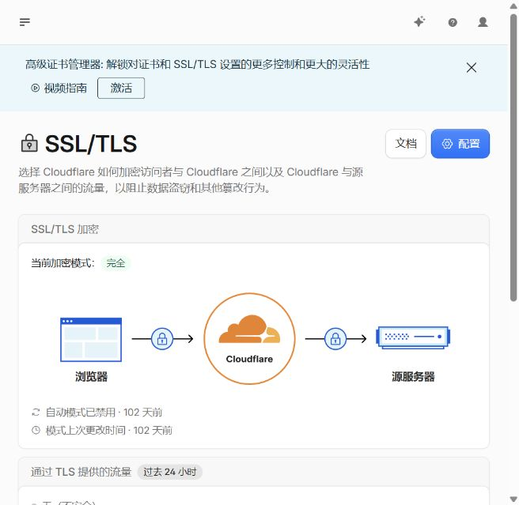
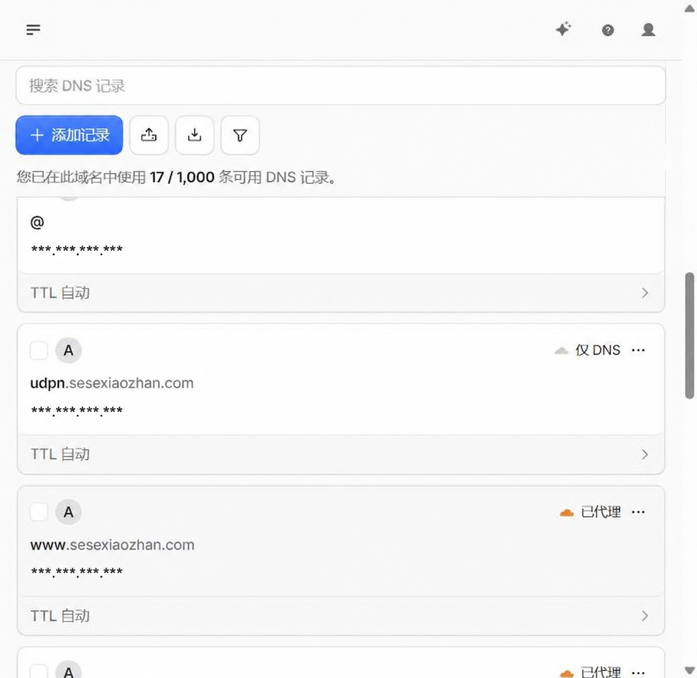

# Production Web Operations

基于 Cloudflare、Nginx 与 Linux 的生产环境 Web 运维实践项目。

项目主要涵盖：

- Cloudflare DNS 管理
- CDN / Proxy 配置
- HTTPS / SSL/TLS
- Nginx 反向代理
- 流量分析
- 安全分析
- 日志排查
- 生产环境故障定位

## 项目架构

架构图正在整理中。

## 生产环境运行证明

以下截图均来自实际运行环境。

为了保护生产环境安全，源站 IP、部分域名及敏感信息已进行脱敏。

### Cloudflare 流量统计

生产环境过去 30 天累计处理百万级 HTTP 请求，用于观察流量趋势、访问来源及异常峰值。

### Security Analytics

通过 Cloudflare Security Analytics 分析请求趋势及异常流量。

### SSL/TLS

客户端与 Cloudflare、Cloudflare 与源站之间均通过 HTTPS 进行通信。

### DNS

Cloudflare 托管 DNS，并根据不同服务用途配置 Proxy 与 DNS Only 记录。

## 技术栈

- Linux
- Nginx
- Cloudflare
- DNS
- HTTPS / TLS
- TCP/IP
- Git

## 后续计划

- 补充整体网络架构图
- 补充 Nginx 配置示例
- 补充日志分析案例
- 补充故障排查记录
- 补充监控与告警方案